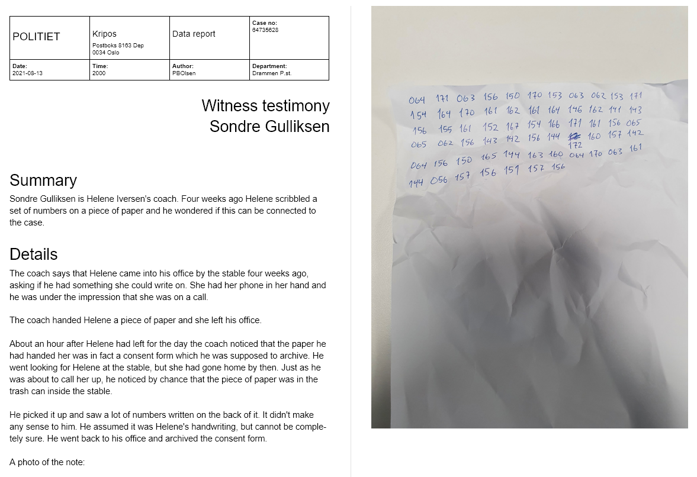
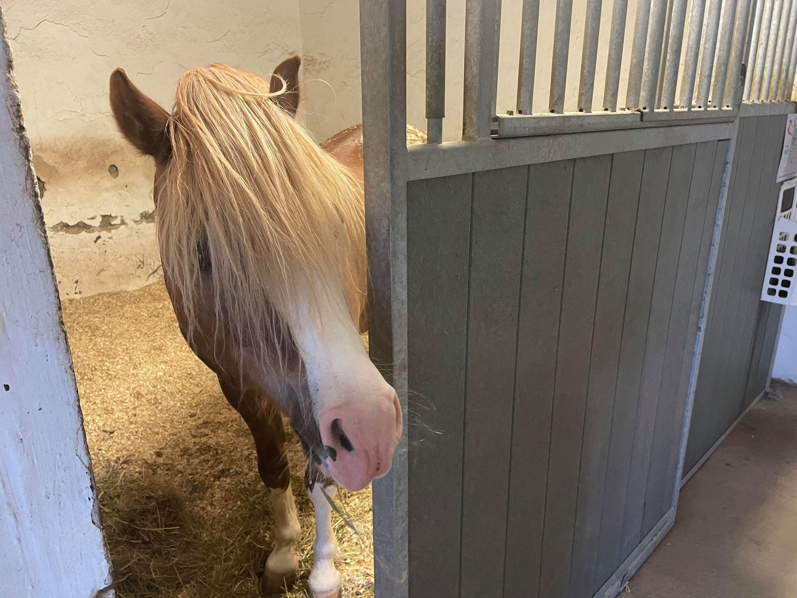

# Bad horsie

## Challenge

> - Analyze the cryptic numeric message left by Helene Iversen on a paper note. Find out what it means and follow the lead. You might need a ressurected tool to extract the hidden message, don't try to GUESS.
> - Find the report mentioning the paper note in the case folder.
> - The flag is the hidden message.
>   Example: "A hidden message."


### Testimony - witness  Sondre Gulliksen.docx



## Approach

This looks like octal numbers. Let's type them into an octal to ASCII converter.

Online converter used: https://onlineasciitools.com/convert-octal-to-ascii

### Octal numbers from note:
```c
064 171 063 156 150 170 153 063 062 153 171 154 164 170 161 162
161 164 145 162 141 143 156 155 161 152 167 154 166 171 161 156
065 065 062 156 143 142 156 144 172 160 157 142 064 156 150 165
144 163 160 064 170 063 161 144 056 157 156 151 157 156
```

### Octal numbers decoded as ASCII:
```
4y3nhxk32kyltxqrqteracnmqjwlvyqn552ncbndzpob4nhudsp4x3qd.onion
```

This is clearly an onion URL. Let's open the Tor Browser and browse to the URL.

Redirects to: `http://4y3nhxk32kyltxqrqteracnmqjwlvyqn552ncbndzpob4nhudsp4x3qd.onion/xxx.jpg`

Downloaded `xxx.jpg`.



My guess is that there might be something embedded in the image.

### Tried the follwing steg tools:
- `steghide extract -sf xxx.jpg`
  - No password
  - `Makaroni<1814` from first challenge
  - `xxx` and `xxx.jpg`
  - Onion URL
- OpenStego
- `strings -n 10 xxx.jpg`
- `binwalk xxx.jpg`
- `exiftool xxx.jpg`
- `exiv2 xxx.jpg`
- https://stegonline.georgeom.net/upload
  - Browsed Bit Planes etc.


### Clue from challenge text

> You might need a ressurected tool to extract the hidden message.

There must be some tool that I haven't tried. I tried to use the clue in Google. I Google'd for `ressurected` (and `resurrected`) combined with different steg terms, but didn't find anything.